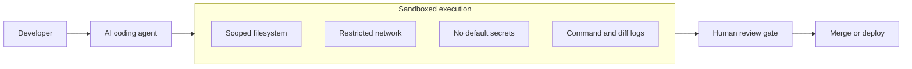

Generated via draw.io MCP from Mermaid:

```mermaid
flowchart LR
UserDev["Developer"] --> Agent["AI coding agent"]
Agent --> Sandbox["Sandbox boundary"]

subgraph Sandbox["Sandboxed execution"]
  FS["Scoped filesystem"]
  NET["Restricted network"]
  SECRETS["No default secrets"]
  LOGS["Command and diff logs"]
end

Sandbox --> Review["Human review gate"]
Review --> Merge["Merge or deploy"]
```
